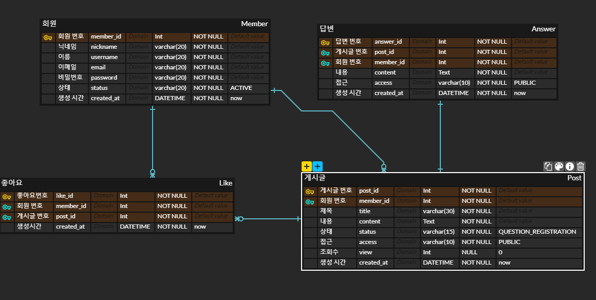

# Q & A 게시판 만들기 기능 요구 사항

## ERD 다이어그램

## 공통 요구 사항

- Q&A 게시판은 회원 전용 게시판으로, 등록된 회원만 사용할 수 있다.
  - Spring Security를 적용하지 않으므로 별도의 회원 로그인 인증 과정은 없는 것으로 간주한다.
  - admin@gmail.com은 관리자의 역할을 하며, 애플리케이션에 상수 형태로 사용한다.

## 질문

### POST 기능 

#### 질문 등록
- 회원만 등록할 수 있다.
- 등록 날짜가 생성되어야 한다.
- 상태 값이 필요하다. (초기 값은 QUESTION_REGISTRATION)

| 상태                    | 특징       |
|-----------------------|----------|
| QUESTION_REGISTRATION | 질문 등록 상태 |
| QUESTION_ANSWERED     | 답변 완료 상태 |
| QUESTION_DELETE       | 질문 삭제 상태 |

- 질문 제목과 내용은 필수입력 사항이다. (Unique)
- 질문의 접근 상태를 설정할 수 있다.

| 상태              | 특징       |
|-----------------|----------|
| QUESTION_PUBLIC | 질문 등록 상태 |
| QUESTION_SECRET | 답변 완료 상태 |

#### 질문에 대한 답변 등록
- 답변은 관리자만 등록할 수 있다.
- 답변 등록 날짜가 생성되어야 한다.
- 답변이 등록되면, 질문의 상태값은 QUESTION_ANSWERED로 변경되어야 한다.
- 내용은 필수 입력 사항이다.
- 질문과 같은 접근 상태를 가진다.

### PATCH 기능

#### 질문 등록
- 질문을 등록한 회원만 수정할 수 있다.
- 질문의 접근 상태를 변경할 수 있다.
- 삭제되는 경우 질문의 상태를 QUESTION_DELETE로 변경
- 답변 완료된 질문은 수정할 수 없다.

#### 답변 수정
등록된 답변의 내용은 관리자만 수정할 수 있다.

### GET 기능

#### 1건의 질문 조회

- 질문은 회원과 관리자 모두 조회할 수 있다.
- 비밀글 상태인 질문은 등록한 회원과 관리자만 조회할 수 있다.
- 질문을 조회하는 경우 해당 질문에 대한 답변도 함께 조회되어야 한다.
- 삭제 상태의 질문은 조회할 수 없다.

#### 여러건의 질문 조회

- 여러 건의 질문 목록은 회원과 관리자 모두 조회할 수 있다.
- 삭제 상태의 질문은 조회할 수 없다.
- 여러 건의 질문 목록에 각각의 질문에 답변이 존재하면 답변도 함께 조회할 수 있다.
- 여러 건의 질문 목록은 페이지네이션 처리가 되어 일정 건수만큼만 조회할 수 있다.
- 여러 건의 질문 목록은 아래의 조건으로 정렬해서 조회할 수 있어야 한다.
  - 최신글 순
  - 오래된 글 순
  - 좋아요가 많은 순으로
  - 좋아요가 적은 순으로
  - 조회수가 많은 순으로
  - 조회수가 적은 순으로

### DELETE 기능

#### 1건의 질문 삭제

- 질문은 등록한 회원만 삭제할 수 있다.
- 질문 삭제시 질문 상태만 변경되고 테이블에서는 삭제되지 않는다.
- 이미 삭제 상태인 질문은 삭제할 수 없다.

#### 답변 삭제

- 관리자만 삭제할 수 있다.
- 답변 삭제 시, 테이블에서 삭제된다.